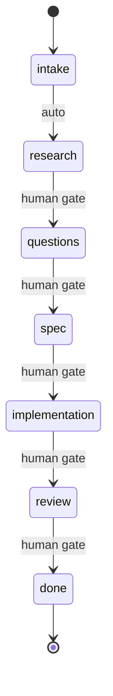

# Contract-Driven Ticket Execution

## Runtime

This skill uses `runtime: mcp`. It invokes MCP tools (Linear, Slack) directly through
the Claude Code tool-use protocol rather than through the skill bootstrapper's handler
dispatch. MCP-first skills are not bootstrapper-dispatched -- the bootstrapper does not
intercept or wrap their MCP tool calls.

## Dispatch Surface

**Target**: Agent Teams

## Overview

Orchestrate ticket execution through structured phases with Linear as the single source of truth. The contract YAML block in the ticket description tracks all state.

**Critical Principle:** This skill requires explicit human confirmation for meaningful phase transitions. The intake→research transition is automatic (nothing to review), but all other transitions require human approval.

**Announce at start:** "I'm using the ticket-work skill to work on {ticket_id}."

> **Skill Ticket Policy**: When this ticket involves skill development (editing SKILL.md, prompt.md, or skill helpers), dispatch all implementation work to a polymorphic agent via `onex:multi_agent --mode sequential-with-review` or `onex:multi_agent --mode parallel-build`. The main agent must remain the orchestrator — never the implementer. See `onex:writing_skills` → "Polly-Dispatch Policy" for details.

## Quick Start

```
/ticket-work OMN-1234
```

This will:
1. Fetch the ticket from Linear
2. Parse or create the contract in the ticket description
3. Announce current phase and pending items
4. Guide you through the workflow

## Phase Flow



Each transition requires:
- Entry invariant satisfied
- Human gate (keyword + confirmation) - except intake→research which is automatic
- Exit invariant satisfied

## Contract Location

The contract is stored as a YAML block at the end of the Linear ticket description:

```markdown
---
## Contract

```yaml
phase: intake
context: {}
questions: []
requirements: []
verification: []
gates: []
commits: []
pr_url: null
```
```

The skill preserves all existing ticket description content above the contract section.

## Human Gates

| Transition | Trigger Keywords |
|------------|------------------|
| intake → research | *(auto-advance, no gate required)* |
| research → questions | "questions ready", "done researching" |
| questions → spec | "requirements clear", "proceed to spec" |
| spec → implementation | "approve spec", "build it" |
| implementation → review | "create PR", "ready for review" |
| review → done | "approve merge", "ship it" |

## Slack Notifications

When waiting for human input or completing work, send a Slack notification via the emit daemon so the user knows action is needed. This uses the event-driven architecture through the runtime.

**When to notify (blocked):**
- Entering `questions` phase with open questions
- Hitting any human gate that requires approval
- Verification failed and blocking further progress

**When to notify (completed):**
- Ticket work finished and PR merged/ready

**CLI Commands:**

```bash
# Blocked notification (via emit daemon -> runtime -> Slack)
python3 -c "
from plugins.onex.hooks.lib.emit_client_wrapper import emit_event
emit_event(
    event_type='notification.blocked',
    payload={
        'ticket_id': '{ticket_id}',
        'reason': '{reason}',
        'details': ['{detail1}', '{detail2}'],
        'repo': '{repo}',
        'session_id': '{session_id}'
    }
)
"

# Completion notification (via emit daemon -> runtime -> Slack)
python3 -c "
from plugins.onex.hooks.lib.emit_client_wrapper import emit_event
emit_event(
    event_type='notification.completed',
    payload={
        'ticket_id': '{ticket_id}',
        'summary': '{what_was_accomplished}',
        'repo': '{repo}',
        'pr_url': '{pr_url}',  # optional
        'session_id': '{session_id}'
    }
)
"
```

**Architecture:**
```
skill -> emit_event() -> emit daemon -> Kafka -> NotificationConsumer -> Slack
```

**Important:** Notifications are best-effort and non-blocking. If `SLACK_WEBHOOK_URL` is not configured on the runtime, they silently no-op. Do not let notification failures block workflow progress.

## Status Emission

Emit agent status events at key workflow points so external systems (dashboards, alerting, observability) can track ticket progress. Status emission is **non-blocking and fail-open** -- if emission fails, log a warning to stderr and continue. Never let a status emission failure block workflow progress.

**CLI invocation pattern:**

```bash
python3 "${CLAUDE_PLUGIN_ROOT}/hooks/lib/emit_ticket_status.py" \
  --state STATE --message "MESSAGE" \
  --phase PHASE --ticket-id {ticket_id} \
  --agent-name "${AGENT_NAME:-ticket-work}" --session-id "${SESSION_ID:-unknown}" \
  [--progress N] [--blocking-reason REASON]
```

**Note:** Always include `--progress` when transitioning phases, using the values from the table below to ensure dashboards and alerting accurately reflect workflow position.

### Phase Transition Emissions

Emit a status event when entering each phase.

**Note:** Every emission requires `--state`, `--message`, `--phase`, and `--ticket-id`. The `--message` column below shows the value to pass for each phase entry. Use the CLI invocation pattern from above.

| Phase Entry | State | Progress | Message | Extra Args |
|-------------|-------|----------|---------|------------|
| intake | working | 0.00 | `"Starting ticket intake"` | `--task "Ticket intake"` |
| research | working | 0.15 | `"Researching codebase"` | `--task "Researching codebase"` |
| questions | awaiting_input | 0.30 | `"Waiting for clarification"` | `--task "Waiting for clarification"`<br>`--blocking-reason "Waiting for answers to clarifying questions"` |
| spec | working | 0.45 | `"Generating specification"` | `--task "Generating specification"` |
| spec gate | blocked | 0.45 | `"Awaiting spec approval"` | `--task "Awaiting spec approval"`<br>`--blocking-reason "Awaiting spec approval"` |
| implementation | working | 0.70 | `"Implementing requirements"` | `--task "Implementing requirements"` |
| review | working | 0.90 | `"Running verification"` | `--task "Running verification"` |
| done | finished | 1.00 | `"Ticket complete"` | `--task "Ticket complete"` |

### Implementation Sub-Progress

During the implementation phase, report granular progress as requirements are completed:

```
progress = 0.70 + 0.20 * (completed_requirements / total_requirements)
```

Example: 3 of 5 requirements done yields progress = 0.82.

```bash
python3 "${CLAUDE_PLUGIN_ROOT}/hooks/lib/emit_ticket_status.py" \
  --state working --message "Implemented 3/5 requirements" \
  --phase implementation --ticket-id {ticket_id} --progress 0.82 \
  --agent-name "${AGENT_NAME:-ticket-work}" --session-id "${SESSION_ID:-unknown}" \
  --metadata '{"requirements_completed": "3", "requirements_total": "5"}'
```

### Error Emission

When a phase encounters an error (e.g., verification failure), emit an error status:

```bash
python3 "${CLAUDE_PLUGIN_ROOT}/hooks/lib/emit_ticket_status.py" \
  --state error --message "Verification failed: tests" \
  --phase review --ticket-id {ticket_id} \
  --agent-name "${AGENT_NAME:-ticket-work}" --session-id "${SESSION_ID:-unknown}" \
  --metadata '{"error": "pytest exit code 1"}'
```

### Important

Status emission must NEVER block workflow progress. If emission fails, log and continue. The CLI wrapper always exits 0 regardless of whether the underlying Kafka emit succeeded.

## Dispatch Contract (Execution-Critical)

**This section governs how the implementation phase executes. Follow it exactly.**

You are an orchestrator for ticket-work phases. You manage the contract, human gates, and phase
transitions. You do NOT write implementation code yourself.

**Rule: When entering the implementation phase, dispatch a polymorphic agent via Task().
Do NOT call Edit(), Write(), or implement code directly in the orchestrator context.**

### spec → implementation transition

After user approves spec ("approve spec", "build it"), execute automation steps (branch, Linear
status, contract update) then run the Decision Context Loader and structural conflict gate
**before** dispatching the implementation agent:

#### Step 1: DecisionContextLoader (inline, no dispatch) <!-- ai-slop-ok: pre-existing step structure -->

```
# Run inline before dispatching implementation agent:
# 1. Call NodeDecisionStoreQueryCompute:
#      scope_services = [ticket.repo_slug]
#      scope_services_mode = ANY
#      epic_id = ticket.epic_id (omit if None)
#      status = ACTIVE
# 2. Format result as structured decisions block:
#
#    --- ACTIVE DECISIONS ---
#    [TECH_STACK_CHOICE/architecture] Use Kafka for all cross-service async comms
#    Rationale: Decouples producers from consumers; fits existing Redpanda infra
#    Rejected: Direct HTTP → tight coupling | gRPC → overkill
#    Decision ID: <uuid>
#    ---
#
#    If no decisions match: inject "No active decisions for this scope."
#    Store block in context for injection into polymorphic agent prompt.
```

#### Step 2: structural conflict gate (inline, no dispatch) <!-- ai-slop-ok: pre-existing step structure -->

```
# Run inline after DecisionContextLoader, before dispatching agent:
# 1. If spec.decisions is empty: skip, proceed to dispatch
# 2. For each decision in spec.decisions:
#      result = check_conflicts(decision, scope=ticket.repo_slug)
#      → returns: {severity: HIGH|MEDIUM|LOW, conflicts: [...], explanation: str}
# 3. HIGH severity found:
#      Post Slack HIGH_RISK gate:
#        "[HIGH_RISK] Structural conflict in spec for {ticket_id}
#         Decision: {new_decision_summary}
#         Conflicts with: {existing_decision_id} — {existing_decision_summary}
#         Reply 'proceed {ticket_id}' to override, or 'hold {ticket_id}' to pause."
#      BLOCK: do not dispatch implementation agent until operator replies
#      "proceed" → continue to dispatch
#      "hold" → exit ticket-work with status: held_conflict
# 4. MEDIUM severity found (no HIGH):
#      Post Slack MEDIUM_RISK notification
#      Continue to dispatch automatically
# 5. LOW only:
#      Log to ticket-work log, continue to dispatch
```

#### Step 3: dispatch implementation agent <!-- ai-slop-ok: pre-existing step structure -->

Dispatch only after Steps 1 and 2 complete (including any HIGH_RISK gate resolution):

```
Task(
  subagent_type="onex:polymorphic-agent",
  description="Implement {ticket_id}: {title}",
  prompt="Implement the following requirements for {ticket_id}: {title}.

    Requirements:
    {requirements_list}

    Relevant files:
    {relevant_files}

    {decisions_block}

    The decisions block above lists active architectural decisions for this repo scope.
    If any implementation choice contradicts a listed decision, flag it before proceeding.

    Execute the implementation. Do NOT commit changes (the orchestrator handles git).
    Report: files changed, what was implemented, any issues encountered."
)
```

The orchestrator reads the agent's result, runs verification, and manages the commit.

### Other phases (intake, research, questions, spec, review, done)

These phases run inline in the orchestrator. They involve reading tickets, asking questions,
presenting specs, and running verification — all lightweight operations that don't need dispatch.

---

## Detailed Orchestration

Full orchestration logic (contract schema, phase handlers, persistence, error handling)
is documented in `prompt.md`. The dispatch contract above is sufficient for the implementation
phase. Load `prompt.md` only if you need reference details for contract parsing, completion
checks, or edge case handling.

---

## Skill Result Output

**Output contract:** `ModelSkillResult` from `omnibase_core.models.skill`

> **Note: This contract reference is behavioral guidance for the LLM executing this skill. Runtime validation not yet implemented.**

When invoked as a composable sub-skill (from ticket-pipeline, epic-team, or other orchestrators),
write to: `$ONEX_STATE_DIR/skill-results/{context_id}/ticket-work.json`

| Field | Value |
|-------|-------|
| `skill_name` | `"ticket-work"` |
| `status` | One of the canonical string values: `"success"`, `"blocked"`, `"pending"`, `"error"` (see mapping below) |
| `extra_status` | Domain-specific status string (see mapping below) |
| `run_id` | Correlation ID |
| `ticket_id` | Linear ticket ID (e.g. `"OMN-1234"`) |
| `extra` | `{"pr_url": str, "phase_reached": str, "commits": list[str]}` |

> **Note on `context_id`:** Prior schema versions included `context_id` as a top-level field. This field is not part of `ModelSkillResult` — it belongs to the file path convention (`$ONEX_STATE_DIR/skill-results/{context_id}/ticket-work.json`). Consumers should derive context from the file path, not from `context_id` in the result body.

**Status mapping:**

| Current status | Canonical `status` (string value) | `extra_status` |
|----------------|-----------------------------------|----------------|
| `done` | `"success"` (`EnumSkillResultStatus.SUCCESS`) | `"done"` |
| `blocked` | `"blocked"` (`EnumSkillResultStatus.BLOCKED`) | `null` |
| `questions_pending` | `"pending"` (`EnumSkillResultStatus.PENDING`) | `"questions_pending"` |
| `error` | `"error"` (`EnumSkillResultStatus.ERROR`) | `null` |

**Behaviorally significant `extra_status` values:**
- `"done"` → ticket-pipeline treats as SUCCESS; advances to local_review phase
- `"questions_pending"` → ticket-pipeline treats as PENDING; posts Slack notification blocked, awaits human answers before retrying
- `null` (blocked) → ticket-pipeline treats as BLOCKED; halts pipeline, emits Slack notification awaiting human gate approval

**Promotion rule for `extra` fields:** If a field appears in 3+ producer skills, open a ticket to evaluate promotion to a first-class field. If any orchestrator consumer (epic-team, ticket-pipeline) branches on `extra["x"]`, that field MUST be promoted.

Example result:

```json
{
  "skill_name": "ticket-work",
  "status": "success",
  "extra_status": "done",
  "ticket_id": "OMN-1234",
  "run_id": "pipeline-1709856000-OMN-1234",
  "extra": {
    "pr_url": "https://github.com/org/repo/pull/123",
    "phase_reached": "done",
    "commits": ["abc1234", "def5678"]
  }
}
```

- `status: success` + `extra_status: "done"`: All phases complete; PR created or changes committed
- `status: blocked`: Waiting for human input (human gate triggered in non-autonomous mode)
- `status: pending` + `extra_status: "questions_pending"`: Stopped at questions phase awaiting answers
- `status: error`: Unrecoverable failure (agent error, verification failure, etc.)

When invoked directly by a human (`/ticket-work OMN-XXXX`), skip writing the result file.

## Error Recovery (Executable)

When the implementation agent returns an error or verification fails repeatedly:

**Auto-dispatch systematic-debugging:**

```
Task(
  subagent_type="onex:polymorphic-agent",
  description="ticket-work: systematic-debugging on implementation failure",
  prompt="The implementation agent for {ticket_id} failed or verification failed.
    Error: {error_details}
    Files touched: {files_list}

    Invoke: Skill(skill=\"onex:systematic_debugging\")

    Use Phase 1 (Backward Tracing) to trace the root cause of the implementation failure.
    Report: root cause, fix recommendation, whether retry is safe, files involved."
)
```

This replaces the former advisory annotation `REQUIRED SUB-SKILL: root-cause-tracing`.

## See Also

- Linear MCP tools (`mcp__linear-server__*`)
- Related: OMN-1807 (ModelTicketContract in omnibase_core) - contract schema mirrors this model
- Related: OMN-1831 (Slack notifications) - notification implementation
- `systematic-debugging` skill (auto-dispatched on implementation failure; Phase 1 covers backward tracing)
- `decision-store` skill (OMN-2768) — DecisionContextLoader and check-conflicts
- `NodeDecisionStoreQueryCompute` (OMN-2767) — decision query node used at spec→implementation gate
